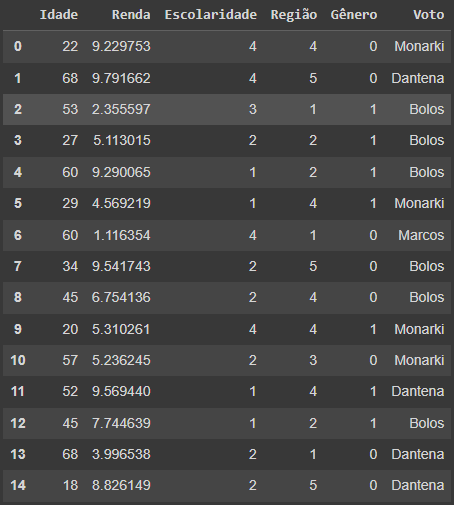
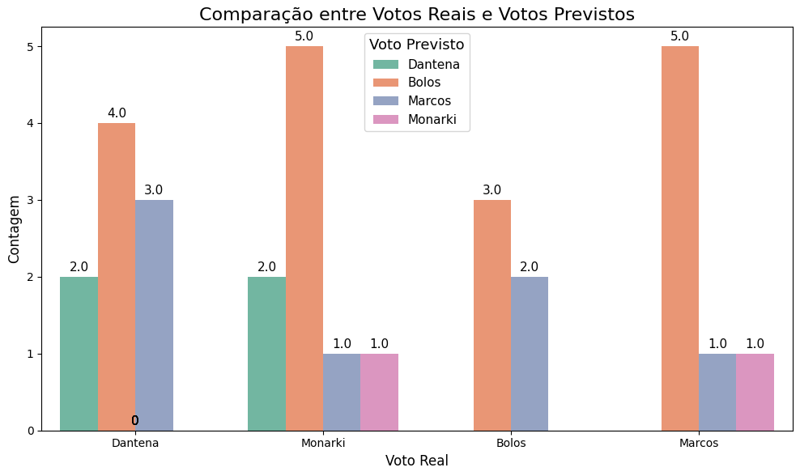
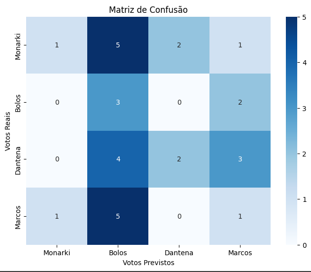

# Previsão Eleitoral 2024: Uma Abordagem de Regressão Logística Multinomial

## Premissa Inicial do Projeto
O ano era 2024, mais um momento de eleições chegou, e neste ano estão concorrendo ao cargo de prefeito grandes influências nacionais:
- **Monarki**: Libertário, com forte apelo aos jovens.
- **Bolos**: Progressista e tem apoio entre eleitores mais instruídos.
- **Dantena**: Ex-apresentador de TV, apela a eleitores de todas as idades, especialmente em regiões urbanas com altos níveis de criminalidade.
- **Marcos**: Conservador com foco em segurança e economia, mais popular entre eleitores de classe média alta.

Devido à grande repercussão, foi solicitado o desenvolvimento de uma previsão de votos para um importante jornal do estado de São Paulo de forma rápida e eficiente.

## Descrição do Projeto

Bem-vindo ao projeto de previsão eleitoral de 2024! Neste projeto, utilizamos uma técnica de **Regressão Logística Multinomial** para prever a intenção de voto dos eleitores para os quatro principais candidatos ao cargo de prefeito de São Paulo.

Com a pressão do período eleitoral e a necessidade de gerar previsões rápidas e precisas, criamos um modelo que explora fatores como **idade**, **renda**, **escolaridade**, **região**, e **gênero** para prever o candidato preferido de cada eleitor. Nossa base de dados é fictícia, porém, reflete as complexidades de uma eleição competitiva.

## Como Funciona?

### 1. Base de Dados
A base de dados foi criada com variáveis que consideramos relevantes para a previsão eleitoral:
- **Idade**: A faixa etária dos eleitores.
- **Renda**: A renda mensal (em milhares).
- **Escolaridade**: Níveis de educação (1: Fundamental, 2: Médio, 3: Superior, 4: Pós-graduação).
- **Região**: A região de residência do eleitor (1: Norte, 2: Sul, 3: Leste, 4: Oeste, 5: Centro).
- **Gênero**: 0 para Masculino, 1 para Feminino.
- **Voto**: O candidato para o qual o eleitor votaria (Monarki, Bolos, Dantena ou Marcos).

### 2. Treinamento do Modelo
Dividimos os dados em conjuntos de treino e teste (70% para treino e 30% para teste) e utilizamos um modelo de **Regressão Logística Multinomial** para ajustar os dados e realizar previsões. O objetivo é identificar padrões nos eleitores com base em suas características e prever o candidato em que votariam.

### 3. Avaliação do Modelo
Utilizamos métricas de avaliação como a **acurácia** e o **relatório de classificação** para medir a performance do modelo, além de visualizarmos os **coeficientes** das variáveis que influenciam cada candidato.

## Visualizações

### 1. Comparação de Votos Reais e Previstos

Este gráfico mostra a comparação entre os votos reais dos eleitores (com base nos dados de teste) e as previsões feitas pelo modelo. As barras indicam quantos eleitores foram corretamente ou incorretamente previstos em cada categoria.

Explicação:
- **Votos Reais**: O voto verdadeiro do eleitor.
- **Votos Previstos**: O voto previsto pelo modelo.
  
Neste gráfico, podemos ver o desempenho do modelo e onde ocorreram os erros de previsão, com as barras representando os votos reais e os previstos.

### 2. Matriz de Confusão

A matriz de confusão detalha os acertos e erros de previsão para cada candidato. As células da diagonal (de cima à esquerda até baixo à direita) representam os acertos do modelo, enquanto as células fora da diagonal representam os erros.

Explicação:
- **Linhas**: Votos reais.
- **Colunas**: Votos previstos.
  
Por exemplo, se um eleitor votou em "Monarki", mas o modelo previu "Bolos", a matriz mostrará um erro correspondente. Esse gráfico ajuda a identificar onde o modelo tem mais dificuldade em acertar.

## Resultados

- **Acurácia**: O modelo atingiu uma acurácia de **30%**, o que reflete um desempenho razoável para dados fictícios e a complexidade do problema.
- **Coeficientes do Modelo**: Os coeficientes mostram como variáveis como renda, idade e região impactam a probabilidade de voto em cada candidato.

Aqui estão os coeficientes das variáveis para cada candidato:

| Variável       | Monarki   | Bolos     | Dantena   | Marcos    |
|----------------|-----------|-----------|-----------|-----------|
| Idade          | 0.012758  | -0.006649 | -0.006327 | 0.000218  |
| Renda          | 0.093561  | -0.084919 | -0.014006 | 0.005364  |
| Escolaridade   | -0.202490 | -0.055791 | 0.221628  | 0.036653  |
| Região         | 0.055703  | 0.195473  | -0.379533 | 0.128357  |
| Gênero         | -0.155673 | 0.408805  | 0.009133  | -0.262265 |

## 🏅 Créditos

Este projeto foi desenvolvido com a colaboração de uma equipe de grandes invocadores! 🌟

- **Caio Silveira Guimarães** 🧠✨
- **Gustavo Martins Gripaldi** 🎮💡
- **Giovanna Monteiro Bispo** 🔍🎯
- **Mariana Monteiro Bispo** 💻🔥
- **Mayron Malaquias Oliveira** ⚡🎨
